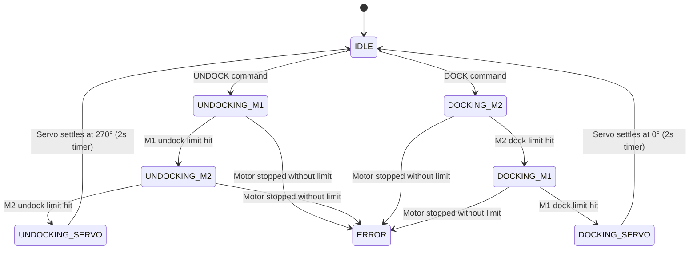

# ESP32 Docking Controller

> Production-grade firmware for an automated docking/undocking mechanism using two NEMA-17 stepper motors, four limit switches, and one feedback servo — orchestrated by a non-blocking state machine on an ESP32-WROOM-32U. Supports both **Serial** and **BLE** command interfaces for integration with Raspberry Pi or any BLE central.

---

## Table of Contents

1. [Overview](#overview)
2. [Hardware Requirements](#hardware-requirements)
3. [Wiring Diagram](#wiring-diagram)
4. [Project Structure](#project-structure)
5. [Architecture](#architecture)
6. [State Machine](#state-machine)
7. [Serial Command API](#serial-command-api)
8. [BLE Communication](#ble-communication)
9. [Configuration Reference](#configuration-reference)
10. [Building & Flashing](#building--flashing)
11. [Servo Feedback Calibration](#servo-feedback-calibration)
12. [Troubleshooting](#troubleshooting)
13. [License](#license)

---

## Overview

This system controls a two-stage mechanical docking mechanism. The workflow is entirely sequential and automated — the operator only issues a single `DOCK` or `UNDOCK` command via serial, and the firmware handles the full multi-step sequence internally.

### Key Features

- **Non-blocking state machine** — no `delay()` calls in the main loop; serial remains responsive at all times.
- **Dual command interface** — accepts commands via both USB Serial and Bluetooth Low Energy (BLE).
- **BLE GATT server** — advertises as `DockController`; a Raspberry Pi (or any BLE central) can write commands and subscribe to real-time status notifications.
- **Accelerated stepper control** via the AccelStepper library with configurable speed and acceleration ramps.
- **Hardware limit switches** on every endpoint (4 total) for safe, deterministic travel.
- **Feedback servo verification** — the servo's built-in potentiometer is read via ADC to confirm it actually reached the target angle before the state machine advances.
- **Timeout protection** — if the servo fails to reach its target within a configurable window, the system enters a safe `ERROR` state.
- **Modular C++ architecture** — each concern (motors, servo, serial parsing, BLE, sequencing) is encapsulated in its own class.

---

## Hardware Requirements

| Component             | Qty | Notes                                                    |
|-----------------------|-----|----------------------------------------------------------|
| ESP32-WROOM-32U       | 1   | Any ESP32 dev board works (NodeMCU-32S, DevKitC, etc.)   |
| NEMA-17 Stepper Motor | 2   | Standard 1.8° / 200 steps-per-revolution                 |
| A4988 or DRV8825      | 2   | Stepper driver modules                                   |
| Feedback Servo        | 1   | 270° servo with analog feedback wire (4-wire servo)      |
| Micro Limit Switches  | 4   | Normally Open (NO), wired to pull LOW when triggered      |
| 12V Power Supply      | 1   | For stepper motors (sized for your NEMA-17 current draw) |
| 5V Power Supply       | 1   | For servo (do NOT power from ESP32 3.3V rail)            |
| Jumper Wires / PCB    | —   | For connections                                          |

---

## Wiring Diagram

### Pin Assignment Table

| Function              | ESP32 GPIO | Direction | Notes                                     |
|-----------------------|------------|-----------|-------------------------------------------|
| **Motor 1 STEP**      | `GPIO 25`  | OUTPUT    | Pulse output to stepper driver STEP pin   |
| **Motor 1 DIR**       | `GPIO 26`  | OUTPUT    | Direction control                         |
| **Motor 1 ENABLE**    | `GPIO 27`  | OUTPUT    | LOW = enabled, HIGH = disabled            |
| **Motor 2 STEP**      | `GPIO 14`  | OUTPUT    | Pulse output to stepper driver STEP pin   |
| **Motor 2 DIR**       | `GPIO 12`  | OUTPUT    | Direction control                         |
| **Motor 2 ENABLE**    | `GPIO 13`  | OUTPUT    | LOW = enabled, HIGH = disabled            |
| **M1 Undock Limit**   | `GPIO 32`  | INPUT_PULLUP | Active LOW — switch connects to GND    |
| **M1 Dock Limit**     | `GPIO 33`  | INPUT_PULLUP | Active LOW — switch connects to GND    |
| **M2 Undock Limit**   | `GPIO 18`  | INPUT_PULLUP | Active LOW — switch connects to GND    |
| **M2 Dock Limit**     | `GPIO 19`  | INPUT_PULLUP | Active LOW — switch connects to GND    |
| **Servo PWM**         | `GPIO 2`   | OUTPUT    | 50 Hz PWM signal to servo                |
| **Servo Feedback**    | `GPIO 36 (VP)` | INPUT | ADC1 channel — reads servo potentiometer |

> **⚠️ Note:** GPIO 34, 35, 36, 39 are **input-only** on the ESP32 and do **not** have internal pull-up resistors. We intentionally avoid using them for limit switches. GPIO 36 (VP) is used only for analog servo feedback reading, where it works correctly.

### Limit Switch Wiring

All four limit switches use the ESP32's internal pull-up resistors (`INPUT_PULLUP`). No external resistors are needed.

```
  ESP32 GPIO (internal pull-up to 3.3V)
         │
       [Switch]
         │
        GND
```

- **Normal state (switch open):** GPIO reads `HIGH` (pulled up)
- **Triggered state (switch pressed):** GPIO reads `LOW` (connected to GND)

### Servo Wiring (4-Wire Feedback Servo)

| Servo Wire | Connect To          |
|------------|---------------------|
| Red        | External 5V supply  |
| Brown/Black| GND (shared with ESP32) |
| Orange     | ESP32 GPIO 2        |
| White (Feedback) | ESP32 GPIO 36 (VP) |

> **⚠️ Critical:** Power the servo from a dedicated 5V supply, **not** from the ESP32's 3.3V or 5V pin. Servo stall current can exceed 1A, which will cause the ESP32 to brownout and reboot.

---

## Project Structure

```
esp32_test/
├── include/
│   ├── Config.h              # All pin definitions, speeds, thresholds, and BLE UUIDs
│   ├── BLEComm.h             # BLE GATT server module
│   ├── DockingSystem.h       # State machine class declaration
│   ├── MotorController.h     # Stepper motor abstraction
│   └── SerialCommand.h       # Serial command parser
├── src/
│   ├── main.cpp              # Entry point — wires everything together
│   ├── BLEComm.cpp           # BLE server, characteristics, and callbacks
│   ├── DockingSystem.cpp     # State machine implementation
│   ├── MotorController.cpp   # Motor + limit switch logic
│   └── SerialCommand.cpp     # Command parsing logic
├── platformio.ini            # Build config, board, and library dependencies
└── README.md                 # This file
```

---

## Architecture

The system follows a clean **separation of concerns** pattern:

```
┌──────────────────────────────────────────────────────────────────┐
│                          main.cpp                                │
│  setup() → init all modules                                      │
│  loop()  → serial.update() + docking.update() + ble.update()     │
└──────┬──────────────────┬──────────────────────┬─────────────────┘
       │                  │                      │
┌──────▼──────┐  ┌────────▼────────────┐  ┌──────▼──────────┐
│SerialCommand│  │   DockingSystem      │  │    BLEComm      │
│             │  │   (State Machine)    │  │                 │
│Parses serial│──│                      │──│ GATT server     │
│commands     │  │ Orchestrates the     │  │ Writes commands  │
│             │  │ multi-step sequence  │  │ Notifies status  │
└─────────────┘  └───┬──────────┬───────┘  └─────────────────┘
                     │          │
         ┌───────────▼──┐  ┌────▼───────────┐
         │MotorController│  │  ESP32Servo    │
         │  (×2)        │  │  + ADC feedback │
         │              │  │                 │
         │ AccelStepper  │  │ servo.write()  │
         │ + limit SW   │  │ analogRead()   │
         └──────────────┘  └────────────────┘
```

### Module Descriptions

| Module | File(s) | Responsibility |
|--------|---------|----------------|
| **Config** | `Config.h` | Single source of truth for all pin assignments, motor speeds, servo angles, feedback thresholds, BLE device name, and GATT UUIDs. Change hardware wiring here — nowhere else. |
| **MotorController** | `MotorController.h/.cpp` | Wraps an `AccelStepper` instance and two limit switch pins. Provides `startUndocking()`, `startDocking()`, and `stop()`. Automatically halts the motor when the appropriate limit switch triggers. Disables the driver when idle to reduce heat. |
| **DockingSystem** | `DockingSystem.h/.cpp` | The core state machine. Manages the sequential workflow across two motors and one servo. Reads the servo's analog feedback pin to verify position before advancing. Exposes `getStateString()` and `stateChanged()` for BLE notifications. Includes timeout-based error handling. |
| **SerialCommand** | `SerialCommand.h/.cpp` | Non-blocking serial listener. Reads one line at a time, trims whitespace, converts to uppercase, and dispatches `DOCK`/`UNDOCK` to the `DockingSystem`. |
| **BLEComm** | `BLEComm.h/.cpp` | BLE GATT server. Creates a service with a writable Command characteristic and a readable/notifiable Status characteristic. Automatically pushes state change notifications to connected clients. Re-advertises on disconnect. |
| **main** | `main.cpp` | Instantiates all modules, calls `init()` in `setup()`, and calls `update()` in `loop()`. |

---

## State Machine

The system operates as a finite state machine with 8 states:



### UNDOCK Sequence (detailed)

| Step | State | Action | Exit Condition |
|------|-------|--------|----------------|
| 1 | `UNDOCKING_M1` | Motor 1 rotates to **undock** direction | M1 undock limit switch triggers (GPIO 32 → LOW) |
| 2 | `UNDOCKING_M2` | Motor 2 rotates to **undock** direction | M2 undock limit switch triggers (GPIO 18 → LOW) |
| 3 | `UNDOCKING_SERVO` | Servo commanded to **270°** | 2-second settle timer |
| 4 | `IDLE` | Prints `UNDOCKING_COMPLETE` via serial | — |

### DOCK Sequence (detailed)

| Step | State | Action | Exit Condition |
|------|-------|--------|----------------|
| 1 | `DOCKING_M2` | Motor 2 rotates to **dock** direction | M2 dock limit switch triggers (GPIO 19 → LOW) |
| 2 | `DOCKING_M1` | Motor 1 rotates to **dock** direction | M1 dock limit switch triggers (GPIO 33 → LOW) |
| 3 | `DOCKING_SERVO` | Servo commanded to **0°** | 2-second settle timer |
| 4 | `IDLE` | Prints `DOCKING_COMPLETE` via serial | — |

### Error Handling

- If a motor stops moving (reaches its `MOTOR_CONTINUOUS_STEPS` target) **without** the limit switch triggering, the system enters `ERROR` state.
- If the servo does not reach its target feedback range within `SERVO_TIMEOUT_MS` (default: 3000ms), the system enters `ERROR` state.
- In `ERROR` state, all motors are disabled and the system ignores further commands. A power cycle (reset) is required to recover.

---

## Serial Command API

| Command  | Action | Response on Success |
|----------|--------|---------------------|
| `UNDOCK` | Starts the full undocking sequence | `UNDOCKING_COMPLETE` |
| `DOCK`   | Starts the full docking sequence   | `DOCKING_COMPLETE`   |

### Serial Configuration

| Parameter | Value   |
|-----------|---------|
| Baud Rate | 115200  |
| Data Bits | 8       |
| Stop Bits | 1       |
| Parity    | None    |
| Line Ending | Newline (`\n`) |

### Progress Messages

During a sequence, the system prints progress messages:

```
Starting UNDOCK sequence...
M1 Undocked. Starting M2...
M2 Undocked. Moving Servo...
UNDOCKING_COMPLETE
```

```
Starting DOCK sequence...
Servo docked. Starting M2 reverse...
M2 Docked. Starting M1 reverse...
DOCKING_COMPLETE
```

### Error Messages

| Message | Meaning |
|---------|---------|
| `System busy, cannot dock.` | A sequence is already in progress |
| `System busy, cannot undock.` | A sequence is already in progress |
| `ERROR: M1 stopped but not undocked.` | Motor 1 exhausted steps without hitting limit |
| `ERROR: M2 stopped but not undocked.` | Motor 2 exhausted steps without hitting limit |
| `ERROR: Servo timeout during undock.` | Servo feedback didn't confirm 270° within timeout |
| `ERROR: Servo timeout during dock.` | Servo feedback didn't confirm 0° within timeout |
| `ERROR: M1 stopped but not docked.` | Motor 1 exhausted steps without hitting limit |
| `ERROR: M2 stopped but not docked.` | Motor 2 exhausted steps without hitting limit |
| `Unknown command. Valid commands: DOCK, UNDOCK` | Unrecognised input |

---

## BLE Communication

The ESP32 runs a BLE GATT server that advertises as **`DockController`**. Any BLE central (Raspberry Pi, phone, etc.) can connect, send commands, and receive real-time status notifications.

### GATT Service & Characteristics

| Element | UUID | Properties | Description |
|---------|------|------------|-------------|
| **Docking Service** | `4fafc201-1fb5-459e-8fcc-c5c9c331914b` | — | Container service |
| **Command** | `beb5483e-36e1-4688-b7f5-ea07361b26a8` | **Write** | Write `DOCK` or `UNDOCK` as a UTF-8 string |
| **Status** | `8c1c10ea-4536-4a5b-9c37-2f7a3e5c1d2b` | **Read + Notify** | Returns current state; auto-notifies on change |

### Status Values

The Status characteristic contains one of these UTF-8 strings:

| Value | Meaning |
|-------|---------|
| `IDLE` | System is idle, ready for commands |
| `UNDOCKING_M1` | Motor 1 is undocking |
| `UNDOCKING_M2` | Motor 2 is undocking |
| `UNDOCKING_SERVO` | Servo moving to 270° |
| `UNDOCKING_COMPLETE` | Undock sequence finished successfully |
| `DOCKING_M2` | Motor 2 is docking |
| `DOCKING_M1` | Motor 1 is docking |
| `DOCKING_SERVO` | Servo moving to 0° |
| `DOCKING_COMPLETE` | Dock sequence finished successfully |
| `ERROR` | A fault occurred (motor or servo) |

### Raspberry Pi Integration (Python `bleak` example)

Install bleak on your Pi: `pip install bleak`

```python
import asyncio
from bleak import BleakClient

DEVICE_MAC = "B4:BF:E9:14:A1:66"   # Your ESP32's BLE MAC (base WiFi MAC + 2)
CMD_UUID   = "beb5483e-36e1-4688-b7f5-ea07361b26a8"
STATUS_UUID = "8c1c10ea-4536-4a5b-9c37-2f7a3e5c1d2b"

def on_status(sender, data):
    status = data.decode()
    print(f"Status update: {status}")
    if status == "UNDOCKING_COMPLETE":
        print("Undocking done! Safe to proceed.")
    elif status == "DOCKING_COMPLETE":
        print("Docking done!")
    elif status == "ERROR":
        print("ERROR detected — check hardware.")

async def main():
    async with BleakClient(DEVICE_MAC) as client:
        # Subscribe to status notifications
        await client.start_notify(STATUS_UUID, on_status)

        # Send undock command
        await client.write_gatt_char(CMD_UUID, b"UNDOCK")
        print("Sent UNDOCK command.")

        # Wait and listen for status updates
        await asyncio.sleep(30)

asyncio.run(main())
```

> **Tip:** You can find your ESP32's MAC address in the serial monitor output during boot, or by scanning with `bluetoothctl` on the Pi.

---

## Configuration Reference

All configurable parameters live in [`include/Config.h`](include/Config.h):

### Pin Assignments

| Constant | Default | Description |
|----------|---------|-------------|
| `M1_STEP_PIN` | 25 | Motor 1 step pulse output |
| `M1_DIR_PIN` | 26 | Motor 1 direction output |
| `M1_ENABLE_PIN` | 27 | Motor 1 driver enable (active LOW) |
| `M2_STEP_PIN` | 14 | Motor 2 step pulse output |
| `M2_DIR_PIN` | 12 | Motor 2 direction output |
| `M2_ENABLE_PIN` | 13 | Motor 2 driver enable (active LOW) |
| `M1_UNDOCK_LIMIT_PIN` | 32 | Motor 1 undock-side limit switch |
| `M1_DOCK_LIMIT_PIN` | 33 | Motor 1 dock-side limit switch |
| `M2_UNDOCK_LIMIT_PIN` | 18 | Motor 2 undock-side limit switch (uses internal pull-up) |
| `M2_DOCK_LIMIT_PIN` | 19 | Motor 2 dock-side limit switch (uses internal pull-up) |
| `SERVO_PIN` | 2 | Servo PWM signal output |
| `SERVO_FEEDBACK_PIN` | 36 | Servo analog feedback input (ADC1, VP) |

### Motor Parameters

| Constant | Default | Description |
|----------|---------|-------------|
| `MOTOR_MAX_SPEED` | 1000.0 | Maximum speed in steps/second |
| `MOTOR_ACCELERATION` | 500.0 | Acceleration in steps/second² |
| `MOTOR_CONTINUOUS_STEPS` | 1000000 | Virtual target distance (must be large enough to never be reached before a limit switch) |

### Servo Parameters

| Constant | Default | Description |
|----------|---------|-------------|
| `SERVO_DOCK_ANGLE` | 0 | Servo angle when docked |
| `SERVO_UNDOCK_ANGLE` | 270 | Servo angle when undocked |
| `SERVO_TIMEOUT_MS` | 3000 | Maximum time (ms) to wait for servo to reach target |

### Servo Feedback Thresholds (ADC 0–4095)

| Constant | Default | Description |
|----------|---------|-------------|
| `SERVO_FB_DOCK_MIN` | 50 | Minimum ADC reading to confirm docked position |
| `SERVO_FB_DOCK_MAX` | 500 | Maximum ADC reading to confirm docked position |
| `SERVO_FB_UNDOCK_MIN` | 3400 | Minimum ADC reading to confirm undocked position |
| `SERVO_FB_UNDOCK_MAX` | 4000 | Maximum ADC reading to confirm undocked position |

> **These threshold values are placeholders.** You must calibrate them for your specific servo. See the [Servo Feedback Calibration](#servo-feedback-calibration) section below.

### BLE Parameters

| Constant | Default | Description |
|----------|---------|-------------|
| `BLE_DEVICE_NAME` | `"DockController"` | The name advertised over BLE |
| `BLE_SERVICE_UUID` | `4fafc201-...` | GATT service UUID |
| `BLE_CMD_CHAR_UUID` | `beb5483e-...` | Command characteristic UUID |
| `BLE_STATUS_CHAR_UUID` | `8c1c10ea-...` | Status characteristic UUID |

---

## Building & Flashing

### Prerequisites

- [PlatformIO CLI](https://docs.platformio.org/en/latest/core/installation/index.html) or PlatformIO IDE extension for VS Code
- USB cable connected to the ESP32

### Commands

```bash
# Build only (no upload)
pio run

# Build and upload to ESP32
pio run -t upload

# Open serial monitor
pio device monitor -b 115200
```

### Upload Issues

If you encounter `Unable to verify flash chip connection`:
1. Try holding the **BOOT** button on the ESP32 while the upload connects.
2. The `upload_speed` is already set to `115200` in `platformio.ini` to avoid high-baud communication failures.

---

## Servo Feedback Calibration

Your feedback servo has an internal potentiometer that outputs a voltage proportional to its shaft angle. The ESP32 reads this via a 12-bit ADC (values 0–4095).

### Calibration Procedure

1. **Upload a calibration sketch** — or use the existing firmware and temporarily add a print statement in the `DockingSystem::update()` loop:

   ```cpp
   Serial.println(analogRead(SERVO_FEEDBACK_PIN));
   ```

2. **Manually command the servo to 0°** and note the ADC reading. For example, if it reads around **220**, set:
   ```cpp
   constexpr int SERVO_FB_DOCK_MIN = 150;   // 220 - margin
   constexpr int SERVO_FB_DOCK_MAX = 300;   // 220 + margin
   ```

3. **Manually command the servo to 270°** and note the ADC reading. For example, if it reads around **3650**, set:
   ```cpp
   constexpr int SERVO_FB_UNDOCK_MIN = 3550;  // 3650 - margin
   constexpr int SERVO_FB_UNDOCK_MAX = 3750;  // 3650 + margin
   ```

4. **Re-upload** the firmware with the updated thresholds.

> **Tip:** Add ±50–100 margin around the measured values to account for ADC noise and mechanical play.

---

## Troubleshooting

| Symptom | Likely Cause | Fix |
|---------|-------------|-----|
| Serial monitor shows repeated gibberish or truncated messages | Baud rate mismatch | Set your serial monitor to **115200** baud |
| `System busy, cannot dock/undock` | A sequence is already running | Wait for the current sequence to complete, or power-cycle to reset from ERROR state |
| `ERROR: Servo timeout` | Servo feedback thresholds not calibrated | Follow the [calibration procedure](#servo-feedback-calibration) |
| Motor doesn't move | ENABLE pin wired incorrectly | Verify ENABLE is LOW to activate the driver. Check stepper driver power (12V) |
| Motor moves but never stops | Limit switch not wired or not triggering | Check wiring; ensure switch pulls GPIO to GND when pressed |
| Motor 2 instantly reports undocked/docked | Using GPIO 34/35 which lack internal pull-ups | Pins have been moved to GPIO 18/19 — verify you are wired to the correct GPIOs |
| ESP32 reboots during servo movement | Brownout from servo current draw | Power the servo from a dedicated 5V supply, not the ESP32 board |
| Upload fails: `port is busy` | Serial monitor is holding the port open | Close the serial monitor, then retry upload |
| Upload fails: `chip stopped responding` | Intermittent USB connection | Disconnect and reconnect USB; hold BOOT during flash |

---

## License

This project is provided as-is for internal/production use. No specific open-source license is applied. Modify freely for your application.
