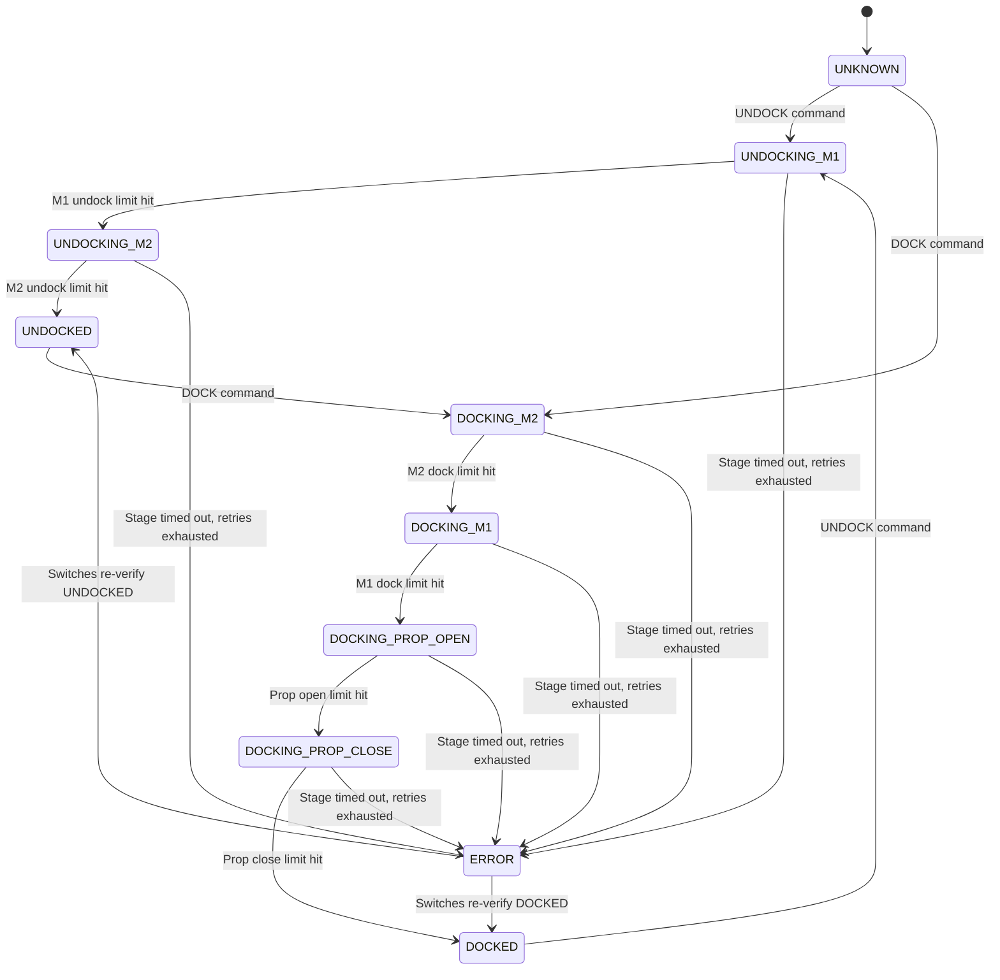

# ESP32 Docking Controller

> Production-grade firmware for an automated docking/undocking mechanism using three NEMA-17 stepper motors and six limit switches — orchestrated by a non-blocking state machine on an ESP32-WROOM-32U. Supports both **Serial** and **BLE** command interfaces for integration with Raspberry Pi or any BLE central.

---

## Table of Contents

1. [Overview](#overview)
2. [Hardware Requirements](#hardware-requirements)
3. [Wiring Diagram](#wiring-diagram)
4. [Project Structure](#project-structure)
5. [Architecture](#architecture)
6. [State Machine](#state-machine)
7. [Serial Command API](#serial-command-api)
8. [BLE Communication](#ble-communication)
9. [Configuration Reference](#configuration-reference)
10. [Building & Flashing](#building--flashing)
11. [Troubleshooting](#troubleshooting)
12. [License](#license)

---

## Overview

This system controls a three-stage mechanical docking mechanism. The workflow is entirely sequential and automated — the operator only issues a single `DOCK` or `UNDOCK` command via serial, and the firmware handles the full multi-step sequence internally.

### Key Features

- **Non-blocking state machine** — no `delay()` calls in the main loop; serial remains responsive at all times.
- **Dual command interface** — accepts commands via both USB Serial and Bluetooth Low Energy (BLE).
- **BLE GATT server** — advertises as `DockController`; a Raspberry Pi (or any BLE central) can write commands and subscribe to real-time status notifications.
- **Accelerated stepper control** via the AccelStepper library with configurable speed and acceleration ramps, used for all three motors.
- **Hardware limit switches** on every endpoint (6 total) for safe, deterministic travel — no encoders or position feedback required.
- **Propeller closer safety default** — the third motor always rests at its close limit; it only opens (to clear the propeller) and closes again as the final step of the dock sequence.
- **Modular C++ architecture** — each concern (motors, serial parsing, BLE, sequencing) is encapsulated in its own class.

---

## Hardware Requirements

| Component             | Qty | Notes                                                    |
|-----------------------|-----|----------------------------------------------------------|
| ESP32-WROOM-32U       | 1   | Any ESP32 dev board works (NodeMCU-32S, DevKitC, etc.)   |
| NEMA-17 Stepper Motor | 3   | Standard 1.8° / 200 steps-per-revolution (M1, M2, propeller closer) |
| A4988 or DRV8825      | 3   | Stepper driver modules                                   |
| Micro Limit Switches  | 6   | Normally Open (NO), wired to pull LOW when triggered      |
| 12V Power Supply      | 1   | For stepper motors (sized for your NEMA-17 current draw) |
| Jumper Wires / PCB    | —   | For connections                                          |

---

## Wiring Diagram

### Pin Assignment Table

| Function              | ESP32 GPIO | Direction | Notes                                     |
|-----------------------|------------|-----------|-------------------------------------------|
| **Motor 1 STEP**      | `GPIO 25`  | OUTPUT    | Pulse output to stepper driver STEP pin   |
| **Motor 1 DIR**       | `GPIO 26`  | OUTPUT    | Direction control                         |
| **Motor 1 ENABLE**    | `GPIO 27`  | OUTPUT    | LOW = enabled, HIGH = disabled            |
| **Motor 2 STEP**      | `GPIO 14`  | OUTPUT    | Pulse output to stepper driver STEP pin   |
| **Motor 2 DIR**       | `GPIO 23`  | OUTPUT    | Direction control                         |
| **Motor 2 ENABLE**    | `GPIO 13`  | OUTPUT    | LOW = enabled, HIGH = disabled            |
| **M1 Undock Limit**   | `GPIO 32`  | INPUT_PULLUP | Active LOW — switch connects to GND    |
| **M1 Dock Limit**     | `GPIO 33`  | INPUT_PULLUP | Active LOW — switch connects to GND    |
| **M2 Undock Limit**   | `GPIO 18`  | INPUT_PULLUP | Active LOW — switch connects to GND    |
| **M2 Dock Limit**     | `GPIO 19`  | INPUT_PULLUP | Active LOW — switch connects to GND    |
| **Motor 3 (Prop Closer) STEP** | `GPIO 4` | OUTPUT | Pulse output to stepper driver STEP pin |
| **Motor 3 (Prop Closer) DIR**  | `GPIO 5` | OUTPUT | Direction control |
| **Motor 3 (Prop Closer) ENABLE** | `GPIO 15` | OUTPUT | LOW = enabled, HIGH = disabled |
| **M3 Open Limit**     | `GPIO 21`  | INPUT_PULLUP | Active LOW — switch connects to GND    |
| **M3 Close Limit**    | `GPIO 22`  | INPUT_PULLUP | Active LOW — switch connects to GND    |

> **⚠️ Note:** GPIO 34, 35, 36, 39 are **input-only** on the ESP32 and do **not** have internal pull-up resistors. We intentionally avoid using them for limit switches.

### Limit Switch Wiring

All six limit switches use the ESP32's internal pull-up resistors (`INPUT_PULLUP`). No external resistors are needed.

```
  ESP32 GPIO (internal pull-up to 3.3V)
         │
       [Switch]
         │
        GND
```

- **Normal state (switch open):** GPIO reads `HIGH` (pulled up)
- **Triggered state (switch pressed):** GPIO reads `LOW` (connected to GND)

---

## Project Structure

```
esp32_test/
├── include/
│   ├── Config.h              # All pin definitions, speeds, thresholds, and BLE UUIDs
│   ├── BLEComm.h             # BLE GATT server module
│   ├── DockingSystem.h       # State machine class declaration
│   ├── MotorController.h     # Stepper motor abstraction
│   └── SerialCommand.h       # Serial command parser
├── src/
│   ├── main.cpp              # Entry point — wires everything together
│   ├── BLEComm.cpp           # BLE server, characteristics, and callbacks
│   ├── DockingSystem.cpp     # State machine implementation
│   ├── MotorController.cpp   # Motor + limit switch logic
│   └── SerialCommand.cpp     # Command parsing logic
├── platformio.ini            # Build config, board, and library dependencies
└── README.md                 # This file
```

---

## Architecture

The system follows a clean **separation of concerns** pattern:

```
┌──────────────────────────────────────────────────────────────────┐
│                          main.cpp                                │
│  setup() → init all modules                                      │
│  loop()  → serial.update() + docking.update() + ble.update()     │
└──────┬──────────────────┬──────────────────────┬─────────────────┘
       │                  │                      │
┌──────▼──────┐  ┌────────▼────────────┐  ┌──────▼──────────┐
│SerialCommand│  │   DockingSystem      │  │    BLEComm      │
│             │  │   (State Machine)    │  │                 │
│Parses serial│──│                      │──│ GATT server     │
│commands     │  │ Orchestrates the     │  │ Writes commands  │
│             │  │ multi-step sequence  │  │ Notifies status  │
└─────────────┘  └───────────┬───────────┘  └─────────────────┘
                              │
                   ┌──────────▼──────────┐
                   │   MotorController    │
                   │        (×3)          │
                   │                       │
                   │  AccelStepper         │
                   │  + limit switches     │
                   └───────────────────────┘
```

### Module Descriptions

| Module | File(s) | Responsibility |
|--------|---------|----------------|
| **Config** | `Config.h` | Single source of truth for all pin assignments, motor speeds, BLE device name, and GATT UUIDs. Change hardware wiring here — nowhere else. |
| **MotorController** | `MotorController.h/.cpp` | Wraps an `AccelStepper` instance and two limit switch pins. Provides `startUndocking()`, `startDocking()`, and `stop()`. Automatically halts the motor when the appropriate limit switch triggers. Disables the driver when idle to reduce heat. Used for all three motors, including the propeller closer (its "undock" limit is the open limit, its "dock" limit is the close limit). |
| **DockingSystem** | `DockingSystem.h/.cpp` | The core state machine. Manages the sequential workflow across all three motors. Exposes `getStateString()` and `stateChanged()` for BLE notifications. Includes limit-switch-based error handling. |
| **SerialCommand** | `SerialCommand.h/.cpp` | Non-blocking serial listener. Reads one line at a time, trims whitespace, converts to uppercase, and dispatches `DOCK`/`UNDOCK` to the `DockingSystem`. |
| **BLEComm** | `BLEComm.h/.cpp` | BLE GATT server. Creates a service with a writable Command characteristic and a readable/notifiable Status characteristic. Automatically pushes state change notifications to connected clients. Re-advertises on disconnect. |
| **main** | `main.cpp` | Instantiates all modules, calls `init()` in `setup()`, and calls `update()` in `loop()`. |

---

## State Machine

The system operates as a finite state machine. `UNKNOWN`/`DOCKED`/`UNDOCKED`/`ERROR` are **stable resting states** — the firmware transitions directly into them and stays there; there's no separate transient "`*_COMPLETE`" pulse that then reverts to a generic idle.



`DOCK`/`UNDOCK` are also accepted from `ERROR` (see `isBusy()`) — a fresh command always starts the relevant motor immediately rather than requiring `RESET` first, since starting the motor is itself the most direct way to find out whether the fault has cleared.

The propeller closer (Motor 3) always rests at its close limit and is **not** touched during the undock sequence. It only opens and re-closes as the final two steps of the dock sequence.

### UNDOCK Sequence (detailed)

| Step | State | Action | Exit Condition |
|------|-------|--------|----------------|
| 1 | `UNDOCKING_M1` | Motor 1 rotates to **undock** direction | M1 undock limit switch triggers (GPIO 32 → LOW) |
| 2 | `UNDOCKING_M2` | Motor 2 rotates to **undock** direction | M2 undock limit switch triggers (GPIO 18 → LOW) |
| 3 | `UNDOCKED` | Stable resting state — prints `UNDOCKING_COMPLETE -- resting UNDOCKED` via serial | — |

### DOCK Sequence (detailed)

| Step | State | Action | Exit Condition |
|------|-------|--------|----------------|
| 1 | `DOCKING_M2` | Motor 2 rotates to **dock** direction | M2 dock limit switch triggers (GPIO 19 → LOW) |
| 2 | `DOCKING_M1` | Motor 1 rotates to **dock** direction | M1 dock limit switch triggers (GPIO 33 → LOW) |
| 3 | `DOCKING_PROP_OPEN` | Motor 3 (propeller closer) rotates to **open** direction | M3 open limit switch triggers (GPIO 21 → LOW) |
| 4 | `DOCKING_PROP_CLOSE` | Motor 3 rotates back to **close** direction | M3 close limit switch triggers (GPIO 22 → LOW) |
| 5 | `DOCKED` | Stable resting state — prints `DOCKING_COMPLETE -- resting DOCKED` via serial | — |

### Error Handling

- Each stage (`UNDOCKING_M1`, `DOCKING_PROP_OPEN`, etc.) has its own elapsed-time watchdog: `STAGE_TIMEOUT_MS` (default 90s — the propeller-closer stage has been observed taking up to ~90s on real hardware). This replaced the old approach of waiting for the motor to exhaust `MOTOR_CONTINUOUS_STEPS`, which at `MOTOR_MAX_SPEED` works out to ~3.7 hours — not a real watchdog.
- A stage that times out is stopped and retried up to `MAX_STAGE_RETRIES` times (default 2), with a `STAGE_RETRY_DELAY_MS` pause (default 1s) before restarting the same stage — handled non-blockingly inside `update()`, not with `delay()`. This absorbs a transient jam or a switch-confirmation delay without masking a genuine fault.
- Once retries are exhausted, the system enters `ERROR`. All motors are disabled.
- `ERROR` (like `UNKNOWN`/`DOCKED`/`UNDOCKED`) is passively re-verified against the limit switches every `REST_RECHECK_INTERVAL_MS` (default 2s) — never by retrying a motor, only by reading where the switches say the mechanism actually is right now. If the physical evidence now genuinely and unambiguously supports `DOCKED` or `UNDOCKED`, `ERROR` clears itself automatically. A `RESET` command (or a fresh `DOCK`/`UNDOCK`) still works at any time and doesn't wait for the recheck interval.

> **Fixed:** `commandUndock()`/`commandDock()` used to publish the new state (`currentState = UNDOCKING_M1` / `DOCKING_M2`) *before* calling `motorX.startUndocking()`/`startDocking()`. Since BLE writes (`CommandCallbacks::onWrite()`) run on the Bluedroid stack's own FreeRTOS task, concurrently with `update()` on the main loop task, there was a race window where `update()` could observe the new state before the motor's `moving` flag had actually flipped `true` — and immediately report `ERROR: M1 stopped but not undocked` without the motor ever moving. Both commands now start the motor *before* publishing the state, closing that window. See `git log -- src/DockingSystem.cpp`.

---

## Serial Command API

| Command  | Action | Response on Success |
|----------|--------|---------------------|
| `UNDOCK` | Starts the full undocking sequence | `UNDOCKING_COMPLETE -- resting UNDOCKED` |
| `DOCK`   | Starts the full docking sequence   | `DOCKING_COMPLETE -- resting DOCKED`   |
| `RESET`  | Stops all motors immediately and re-derives the resting state from the limit switches (recovers from `ERROR`) | `[RESET] System recovered. State: <UNKNOWN\|DOCKED\|UNDOCKED>` — and notifies that state over BLE (see below) |
| `STATUS` | Prints current state and every limit switch reading | `[STATUS] State=... M1_undock=... ...` |
| `JOG1`   | Bench test: spins Motor 1 for `JOG_DURATION_MS` (5s default), ignoring limit switches | `[JOG] Done.` |
| `JOG2`   | Bench test: spins Motor 2 for `JOG_DURATION_MS` (5s default), ignoring limit switches | `[JOG] Done.` |
| `JOG3`   | Bench test: spins the propeller closer motor for `JOG_DURATION_MS` (5s default), ignoring limit switches | `[JOG] Done.` |

> **Note:** `JOG1`/`JOG2`/`JOG3` are rejected while `isBusy()` (any active DOCK/UNDOCK/jog stage) and are meant for verifying a motor spins and is wired correctly. Unlike `DOCK`/`UNDOCK`, jog always runs for the full duration — it deliberately ignores limit switches so you can bench-test a motor before switches are mounted, or observe it run smoothly for the whole window even if a switch trips partway through. Afterward the resting state is re-derived from the switches rather than assumed, since jog can leave the mechanism in an arbitrary position.

### Serial Configuration

| Parameter | Value   |
|-----------|---------|
| Baud Rate | 115200  |
| Data Bits | 8       |
| Stop Bits | 1       |
| Parity    | None    |
| Line Ending | Newline (`\n`) |

### Progress Messages

During a sequence, the system prints progress messages:

```
Starting UNDOCK sequence: M1 -> M2
M1 Undocked. Starting M2...
UNDOCKING_COMPLETE -- resting UNDOCKED
```

```
Starting DOCK sequence: M2 -> M1 -> PROP_OPEN -> PROP_CLOSE
M2 Docked. Starting M1...
M1 Docked. Opening propeller closer...
Propeller closer open. Closing again...
DOCKING_COMPLETE -- resting DOCKED
```

A stage that times out and retries prints, then either recovers into the next stage or gives up into `ERROR`:

```
WARNING: M1 undock timed out — will retry (attempt 1/2)
Retrying stage: M1 undock
```

### Error Messages

| Message | Meaning |
|---------|---------|
| `System busy, cannot dock.` | A sequence is already in progress |
| `System busy, cannot undock.` | A sequence is already in progress |
| `WARNING: <stage> timed out — will retry (attempt N/2)` | A stage exceeded `STAGE_TIMEOUT_MS` without its limit switch triggering; motor stopped, will restart after `STAGE_RETRY_DELAY_MS` |
| `ERROR: <stage> timed out after N attempt(s) — giving up` | The stage timed out more than `MAX_STAGE_RETRIES` times; system enters `ERROR` |
| `System busy, cannot jog.` | A sequence or another jog test is already in progress |
| `Unknown motor. Valid: JOG1, JOG2, JOG3` | Unrecognised jog target |
| `Unknown command. Valid: DOCK, UNDOCK, RESET, STATUS, JOG1, JOG2, JOG3` | Unrecognised input |

---

## BLE Communication

The ESP32 runs a BLE GATT server that advertises as **`DockController`**. Any BLE central (Raspberry Pi, phone, etc.) can connect, send commands, and receive real-time status notifications.

### GATT Service & Characteristics

| Element | UUID | Properties | Description |
|---------|------|------------|-------------|
| **Docking Service** | `4fafc201-1fb5-459e-8fcc-c5c9c331914b` | — | Container service |
| **Command** | `beb5483e-36e1-4688-b7f5-ea07361b26a8` | **Write** | Write `DOCK` or `UNDOCK` as a UTF-8 string |
| **Status** | `8c1c10ea-4536-4a5b-9c37-2f7a3e5c1d2b` | **Read + Notify** | Returns current state; auto-notifies on change |

### Status Values

The Status characteristic contains one of these UTF-8 strings:

| Value | Meaning |
|-------|---------|
| `UNKNOWN` | Position not verified against the limit switches (e.g. very first boot before switches settle) |
| `DOCKED` | Stable resting state — drone secured |
| `UNDOCKED` | Stable resting state — drone released, safe to fly |
| `UNDOCKING_M1` | Motor 1 is undocking |
| `UNDOCKING_M2` | Motor 2 is undocking |
| `DOCKING_M2` | Motor 2 is docking |
| `DOCKING_M1` | Motor 1 is docking |
| `DOCKING_PROP_OPEN` | Propeller closer opening |
| `DOCKING_PROP_CLOSE` | Propeller closer closing again |
| `ERROR` | A stage exhausted its retries without its limit switch triggering |

`DOCKED`/`UNDOCKED` are the two stable resting states — the firmware transitions directly into them and stays there. There's no separate transient "`*_COMPLETE`" status that then reverts to something generic; a BLE client should treat receiving `DOCKED`/`UNDOCKED` itself as the completion signal.

> **Fixed:** `commandReset()` used to set both `currentState` and `lastReportedState` to the same value in the same call. `stateChanged()` (which drives BLE notifications) compares those two fields and only notifies when they differ — setting both left the Status characteristic frozen on whatever value it had before RESET, indefinitely, since nothing would ever look like a "change" again until the next real DOCK/UNDOCK. `commandReset()` now only touches `currentState`, so the next `update()` tick correctly sees the mismatch and notifies the re-derived state. See `git log -- src/DockingSystem.cpp`.

### Raspberry Pi Integration (Python `bleak` example)

Install bleak on your Pi: `pip install bleak`

```python
import asyncio
from bleak import BleakClient

DEVICE_MAC = "B4:BF:E9:14:A1:66"   # Your ESP32's BLE MAC (base WiFi MAC + 2)
CMD_UUID   = "beb5483e-36e1-4688-b7f5-ea07361b26a8"
STATUS_UUID = "8c1c10ea-4536-4a5b-9c37-2f7a3e5c1d2b"

def on_status(sender, data):
    status = data.decode()
    print(f"Status update: {status}")
    if status == "UNDOCKED":
        print("Undocking done! Safe to proceed.")
    elif status == "DOCKED":
        print("Docking done!")
    elif status == "ERROR":
        print("ERROR detected — check hardware.")

async def main():
    async with BleakClient(DEVICE_MAC) as client:
        # Subscribe to status notifications
        await client.start_notify(STATUS_UUID, on_status)

        # Send undock command
        await client.write_gatt_char(CMD_UUID, b"UNDOCK")
        print("Sent UNDOCK command.")

        # Wait and listen for status updates
        await asyncio.sleep(30)

asyncio.run(main())
```

> **Tip:** You can find your ESP32's MAC address in the serial monitor output during boot, or by scanning with `bluetoothctl` on the Pi.

---

## Configuration Reference

All configurable parameters live in [`include/Config.h`](include/Config.h):

### Pin Assignments

| Constant | Default | Description |
|----------|---------|-------------|
| `M1_STEP_PIN` | 25 | Motor 1 step pulse output |
| `M1_DIR_PIN` | 26 | Motor 1 direction output |
| `M1_ENABLE_PIN` | 27 | Motor 1 driver enable (active LOW) |
| `M2_STEP_PIN` | 14 | Motor 2 step pulse output |
| `M2_DIR_PIN` | 23 | Motor 2 direction output (moved off GPIO12 — a flash-voltage strapping pin) |
| `M2_ENABLE_PIN` | 13 | Motor 2 driver enable (active LOW) |
| `M1_UNDOCK_LIMIT_PIN` | 32 | Motor 1 undock-side limit switch |
| `M1_DOCK_LIMIT_PIN` | 33 | Motor 1 dock-side limit switch |
| `M2_UNDOCK_LIMIT_PIN` | 18 | Motor 2 undock-side limit switch (uses internal pull-up) |
| `M2_DOCK_LIMIT_PIN` | 19 | Motor 2 dock-side limit switch (uses internal pull-up) |
| `M3_STEP_PIN` | 4 | Motor 3 (propeller closer) step pulse output |
| `M3_DIR_PIN` | 5 | Motor 3 (propeller closer) direction output |
| `M3_ENABLE_PIN` | 15 | Motor 3 (propeller closer) driver enable (active LOW) |
| `M3_OPEN_LIMIT_PIN` | 21 | Propeller closer open-side limit switch |
| `M3_CLOSE_LIMIT_PIN` | 22 | Propeller closer close-side limit switch |

### Motor Parameters

| Constant | Default | Description |
|----------|---------|-------------|
| `MOTOR_MAX_SPEED` | 75.0 | Maximum speed in steps/second (shared by all three motors) |
| `MOTOR_ACCELERATION` | 500.0 | Acceleration in steps/second² (shared by all three motors) |
| `MOTOR_CONTINUOUS_STEPS` | 1000000 | Virtual target distance (must be large enough to never be reached before a limit switch) |
| `JOG_DURATION_MS` | 5000 | How long `JOG1`/`JOG2`/`JOG3` spin a motor for |
| `LIMIT_DEBOUNCE_MS` | 30 | A limit switch reading must hold steady this long before it's trusted — filters brief noise spikes (e.g. from motor start transients) |

### Stage Watchdog Parameters

| Constant | Default | Description |
|----------|---------|-------------|
| `STAGE_TIMEOUT_MS` | 90000 (90s) | Max time a single stage (e.g. `UNDOCKING_M1`, `DOCKING_PROP_CLOSE`) may run before it's considered stuck. The propeller-closer stage has been observed taking up to ~90s on real hardware — keep this comfortably above that. |
| `MAX_STAGE_RETRIES` | 2 | How many times a timed-out stage is stopped and restarted before the system gives up into `ERROR` |
| `STAGE_RETRY_DELAY_MS` | 1000 | Non-blocking pause between a timed-out stage and its retry attempt |
| `REST_RECHECK_INTERVAL_MS` | 2000 | How often `UNKNOWN`/`DOCKED`/`UNDOCKED`/`ERROR` are passively re-verified against the limit switches — lets a drifted reading self-correct, and lets `ERROR` clear itself if the switches now genuinely agree on `DOCKED`/`UNDOCKED` |

### BLE Parameters

| Constant | Default | Description |
|----------|---------|-------------|
| `BLE_DEVICE_NAME` | `"DockController"` | The name advertised over BLE |
| `BLE_SERVICE_UUID` | `4fafc201-...` | GATT service UUID |
| `BLE_CMD_CHAR_UUID` | `beb5483e-...` | Command characteristic UUID |
| `BLE_STATUS_CHAR_UUID` | `8c1c10ea-...` | Status characteristic UUID |

---

## Building & Flashing

### Prerequisites

- [PlatformIO CLI](https://docs.platformio.org/en/latest/core/installation/index.html) or PlatformIO IDE extension for VS Code
- USB cable connected to the ESP32

### Commands

```bash
# Build only (no upload)
pio run

# Build and upload to ESP32
pio run -t upload

# Open serial monitor
pio device monitor -b 115200
```

### Upload Issues

If you encounter `Unable to verify flash chip connection`:
1. Try holding the **BOOT** button on the ESP32 while the upload connects.
2. The `upload_speed` is already set to `115200` in `platformio.ini` to avoid high-baud communication failures.

---

## Troubleshooting

| Symptom | Likely Cause | Fix |
|---------|-------------|-----|
| Serial monitor shows repeated gibberish or truncated messages | Baud rate mismatch | Set your serial monitor to **115200** baud |
| `System busy, cannot dock/undock` | A sequence is already running | Wait for the current sequence to complete. `DOCK`/`UNDOCK` are accepted from `ERROR` too — you don't need to `RESET` first, a fresh command will re-attempt the stage directly |
| Stuck in `ERROR` after a stage exhausted its retries | A motor genuinely isn't reaching its limit switch (mechanical jam, wiring fault, or a switch that never triggers) | Physically inspect the mechanism/wiring for that motor. `ERROR` self-clears every `REST_RECHECK_INTERVAL_MS` if the switches come to genuinely, unambiguously agree on `DOCKED`/`UNDOCKED` on their own — otherwise send `RESET` (or a fresh `DOCK`/`UNDOCK`) once fixed |
| Motor doesn't move | ENABLE pin wired incorrectly | Verify ENABLE is LOW to activate the driver. Check stepper driver power (12V) |
| Motor moves but never stops | Limit switch not wired or not triggering | Check wiring; ensure switch pulls GPIO to GND when pressed |
| Motor 2 instantly reports undocked/docked | Using GPIO 34/35 which lack internal pull-ups | Pins have been moved to GPIO 18/19 — verify you are wired to the correct GPIOs |
| Propeller closer doesn't close on boot | Motor was mid-cycle at power loss | This is expected — firmware detects it's off the close limit and auto-closes it during `init()` |
| Upload fails: `port is busy` | Serial monitor is holding the port open | Close the serial monitor, then retry upload |
| Upload fails: `chip stopped responding` | Intermittent USB connection | Disconnect and reconnect USB; hold BOOT during flash |

---

## License

This project is provided as-is for internal/production use. No specific open-source license is applied. Modify freely for your application.
